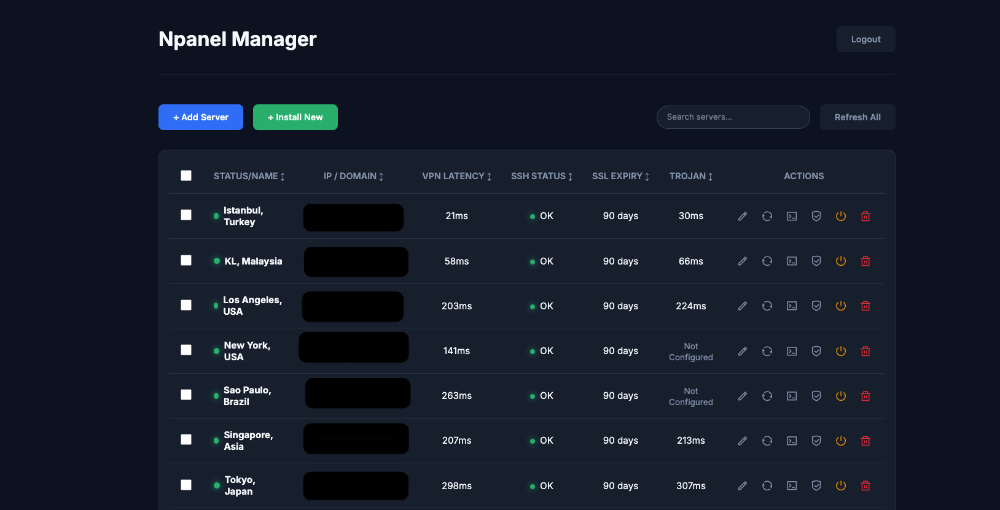

# NPanel TrojanGo Manager Studio


A self-hosted control plane for a fleet of [NPanel](https://github.com/Leiren/Npanel) / Trojan-Go VPN nodes. It does two jobs from one codebase:

- **Manager Studio** — a web admin panel to provision Ubuntu VPS boxes into TLS-secured Trojan-Go servers over SSH, then monitor, renew certificates, reboot, and open a live terminal to them.
- **Mobile VPN backend** — a multi-tenant, attested, HMAC-signed `/v1` API that serves VPN configs to your iOS/Android apps, records connection logs for legal lookups, and enforces device/IP/account bans.

The companion Flutter client lives in a separate repo and talks to the `/v1` API documented in [`docs/mobile-api.md`](docs/mobile-api.md).



---

## What it actually is

NPanel is the VPN node software that runs *on each VPS* and terminates Trojan-Go traffic. This project is the layer **above** it: a single backend + admin panel that manages many nodes and exposes a curated subset of them to one or more mobile apps.

Data flows through a small chain — understanding it is the key to using the panel:

```
Country ──< Server ──< NpanelUser ──< VpnCatalogItem >── App (tenant)
  (AR)       (VPS)       (Free1…)        (a config)      (your mobile app)
```

- **Country** — a flag + display group the app shows (e.g. Argentina, `AR`).
- **Server** — one VPS: IP, SSH creds (encrypted at rest), domain/SNI, VPN port.
- **NpanelUser** — a Trojan account on that server (password, speed/traffic limits, free/premium).
- **VpnCatalogItem** — *the thing the app actually connects to*: a server+user pair turned into a `trojan://` config, tagged `free`/`premium`, attached to a country, with `status` `draft`/`active`.
- **App** — a mobile app tenant. Each app has its own `X-App-Key` + HMAC secret and only sees the catalog items you explicitly assign to it.

A config reaches a phone only when **(1)** its catalog item is `active` **and (2)** it is assigned to that app. Everything else (servers, draft items, unassigned items) stays private to the panel.

---

## Requirements

- **Backend host**: Node.js 16+ and a database — MySQL 8 (`utf8mb4`) for production, or SQLite for local/dev.
- **VPN nodes**: fresh Ubuntu 20.04/22.04 VPS, one domain/subdomain (A record) per node for Let's Encrypt.
- **Production fronting**: Cloudflare in front of the backend is assumed for trustworthy client IPs (see `TRUST_PROXY_HOPS` / `CF_ENFORCE`).

---

## Install & run

```bash
git clone <your-repo-url>
cd NPanel-TrojanGo-Manager-Studio
npm install
cp .env.example .env        # then edit — see Configuration below
npm run migrate             # create/upgrade all tables (idempotent)
npm start                   # serves the admin panel + API on PORT
```

Open `http://localhost:3210` and log in with `ADMIN_PASSWORD`.

- Pending migrations auto-run on boot; `npm run migrate:status` lists them.
- For a quick local spin-up without MySQL, set `DB_DIALECT=sqlite` in `.env`.
- `npm test` runs the service test suite (uses SQLite).

The schema is owned by the Umzug migrations in `src/migrations/`, **not** by `sequelize.sync()` — always migrate rather than relying on auto-sync.

---

## Configuration

All settings come from `.env` (a default file is generated on first boot if missing). The ones that matter:

| Variable | Purpose |
|---|---|
| `ADMIN_PASSWORD` / `ADMIN_PASSWORD_HASH` | Admin panel login. Prefer the bcrypt hash; if both are unset, login is disabled. |
| `ADMIN_SESSION_SECRET` | Signs admin session tokens. Required (32+ random bytes). |
| `PORT` | Listen port (default `3210`). |
| `DB_DIALECT` | `mysql` (production) or `sqlite` (dev/test). |
| `DB_HOST/PORT/USER/PASSWORD/NAME` | MySQL connection. |
| `DB_ENCRYPTION_KEY` | 32-byte hex key encrypting secrets at rest (SSH/NPanel/HMAC). **Back this up — losing it makes encrypted columns unrecoverable.** |
| `TRUST_PROXY_HOPS` | Proxy hops in front of Node (Cloudflare→Node = 1). Never `true`. |
| `CF_ENFORCE` | When `true`, reject `/v1` traffic whose peer isn't a Cloudflare edge. |
| `MOBILE_ATTESTATION_MODE` | `development` (accepts mock attestation — local only) or `strict` (real App Attest / Play Integrity). |
| `GOOGLE_APPLICATION_CREDENTIALS_DIR` | Directory of per-app Play Integrity service-account JSONs. |
| `AUDIT_LOG_RETENTION_DAYS` / `CONNECTION_LOG_RETENTION_DAYS` | Daily purge horizons (default 90 / 365). |

> Ship with `MOBILE_ATTESTATION_MODE=strict` in production. `development` accepts mock attestation tokens and is for local testing only.

---

## Admin panel

Four tabs, each backed by the same REST API the panel itself calls:

- **Servers** — add a server you already run, or **Install** to provision a fresh VPS end-to-end over SSH (apt, dependencies, Certbot TLS, NPanel install, panel config, default users, health check) with live per-step progress. Per server: edit, refresh status, renew SSL, reboot, web terminal (xterm.js over Socket.IO), delete.
- **VPN list** — catalog grouped by country. Toggle a config between `draft` and `active`, override entry IP / SNI, delete.
- **Apps** — create app tenants (returns the `X-App-Key` + HMAC secret **once**), rotate keys, and tick which catalog items each app exposes.
- **Logs** — search connection logs (by firebase UID / IP / device / date), browse registered devices, and manage IP / device / firebase-UID bans.

### Bringing a server online for an app

1. **Apps → New app** — copy the `X-App-Key` and HMAC secret into your mobile build.
2. **Servers → Add / Install** — give it the real **IP** (becomes the iOS entry IP) and **domain** (becomes the SNI). Default free/premium users and draft catalog items are created automatically.
3. **VPN list** — flip the catalog items you want live from `draft` to `active`.
4. **Apps → Catalog** — tick those items so this app exposes them.
5. **Countries** — type a 2-letter ISO code; the flag URL auto-fills.

`GET /v1/configs` then returns exactly the items ticked in step 4.

> Heads-up: a server's country is initially **guessed from its name** (the text after the last comma, e.g. `"Node 1, Argentina"` → `Argentina`; no comma → `Imported`). Name servers accordingly, or re-point catalog items to the right country afterwards.

---

## Mobile API (`/v1`)

Full contract in [`docs/mobile-api.md`](docs/mobile-api.md). In short:

1. **Handshake** — `POST /v1/auth/challenge` → attest (iOS App Attest / Android Play Integrity) → `POST /v1/auth/token` returns `accessToken` + `refreshToken` + `sessionSecret`.
2. **Signed data calls** — every request carries `X-App-Key` and, for data endpoints, an HMAC signature:
   `X-Signature = HMAC_SHA256( SHA256(sessionSecret), METHOD\nPATH\nX-Timestamp\nX-Nonce\nX-Body-SHA256 )`.
3. **Endpoints** — `GET /v1/configs[?type=free|premium]`, `GET /v1/countries`, `POST /v1/sessions/start`, `POST /v1/sessions/stop`.

Each config exposes `connection.uri` (the full `trojan://` URI — Android parses it directly) plus `connection.host` (the entry IP, kept separate from the SNI so iOS can dial the IP while presenting the domain). Premium gating is client-side (RevenueCat); the backend tags items `free`/`premium` and records what each device reported.

See [`docs/MIGRATION-GUIDE.md`](docs/MIGRATION-GUIDE.md) for the full go-live checklist (deploy, attestation wiring, on-device QA matrix).

---

## Security model

- **Per-tenant isolation** — every `/v1` request is scoped to its `X-App-Key`; an app can only ever see its own assigned catalog, devices, and sessions.
- **Device attestation** — strict mode verifies iOS App Attest and Android Play Integrity before issuing a session.
- **Request signing** — short-lived access tokens plus an HMAC signature over method/path/timestamp/nonce/body; nonces are single-use (replay-rejected) and timestamps must be within a 2-minute skew.
- **Secrets at rest** — SSH passwords, NPanel admin passwords, and per-app HMAC secrets are encrypted with `DB_ENCRYPTION_KEY`; sanitizers strip them from every API response.
- **Connection logging** — each session records the real client IP, entry IP, device, and (if signed in) firebase UID, with server-computed duration, for court-order lookups. Retention is purged daily.
- **Bans** — block by IP, device id, or firebase UID, globally or per app.
- **Rate limiting** — 90 req/min per (real IP + device) on `/v1`, plus a brute-force guard on admin login.

---

## Known limitations

- **Remote NPanel user provisioning is a stub.** `npanelClient.syncUser` prepares the create/update payloads but does **not** create the Trojan user on the node — NPanel's encrypted (cEnc/cDec) binary framing isn't published. In practice the Trojan password in a served config must already exist on the node (create it via the NPanel panel, or paste a known-working config). Closing this needs an NPanel protocol adapter.
- **Single-instance state.** The rate-limit buckets and request nonces are in-memory / single-DB. Run one backend instance until this is moved to Redis for horizontal scale.
- **iOS ATS not fully tightened.** The client still makes some cleartext calls (e.g. ip-api.com). Tighten `NSAllowsArbitraryLoads` and finalize cert pinning as a production hardening step.

---

## Project layout

```
src/
  server.js              Express app, Socket.IO, cron jobs, bootstrap
  routes/api.js          Admin REST + mobile /v1 endpoints
  models/Database.js     Sequelize models + associations
  migrations/            Umzug schema migrations (source of truth)
  services/
    provisionService.js  SSH install pipeline (step-by-step)
    sshService.js        SSH exec / SSL renew / reboot
    monitorService.js    Latency + SSH/health status
    mobileSecurityService.js  Attestation, token issuance, request signing
    catalogSerializer.js Catalog item → mobile config shape
    connectionLogService.js   Session logging + retention
    tenantService.js     X-App-Key tenant resolution
    banService.js        IP / device / UID ban enforcement
  public/                Admin panel (vanilla JS + xterm.js)
docs/
  mobile-api.md          The /v1 contract
  MIGRATION-GUIDE.md     Deploy + go-live checklist
```

---

## Credits & license

Built on top of [Leiren/NPanel](https://github.com/Leiren/Npanel) (the VPN node software) and Trojan-Go. Distributed under the MIT License — see [LICENSE](LICENSE).
